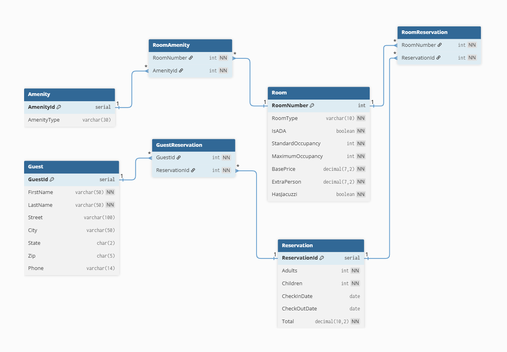

# Hotel Database Data Engineering and Analysis

A demonstration project showcasing data engineering and analysis practices using a hotel reservation database. It includes SQL scripts (schema, inserts, stored procedures), Python integration, ERD diagrams, and sample data workflows.

To avoid duplication and for saving time the sample data insertion scripts and table creation scripts are taken from an existing repo (https://github.com/riddleew/Hotel-Reservation-Database-SQL/tree/master), and are modified to adapt to PostgreSQL. The rest (Queries, Stored Procedures, Python files, Analysis related files, and other relevant technical materials) are original to this project and are not taken from other repos.

---
<br>

##  Table of Contents
- [Overview](#overview)
- [Folder Structure](#folder-structure)
- [Getting Started](#getting-started)
- [Usage Examples](#usage-examples)
- [Visuals](#visuals)
- [Contributing](#contributing)
- [License](#license)
- [Contact](#contact)

---
<br>


## Overview  
This project demonstrates core data engineering workflows with a realistic hotel reservation system:  
1. **Database schema design** using SQL  
2. **Sample data population** for testing  
3. **Stored procedures/business logic** in SQL  
4. **Python scripts** for automated data querying and ETL  
5. **ERD diagram** for visual schema understanding  

---
<br><br>


## Folder Structure
 hotel-db-data-engineering-analysis/
 
    ├── README.md
    ├── 📁 assets/
    │   └── erd.png
    ├── 📁 sql/
    │   ├── create_tables.sql
    │   ├── insert_data.sql
    │   └── stored_procedures.sql
    ├── 📁 python/
    │   └── db_connect_and_query.py
    ├── 📁 data/
    │   └── sample_data.csv (not yet needed, possible data dumps)
    ├── 📁 diagrams/
    │   └── erd.png
    └── 📁 docs/
        └── description.md (not yet needed)


---
<br><br>


##  Getting Started

### Prerequisites  
- PostgreSQL (or another SQL-compatible database/server)  
- pgAdmin (or another SQL client/interface) 
- Python 3.x  
- Python DB driver such as `psycopg2`  
<br>

### Database Setup/Creation and Data Insertion

```bash

# 1. Create the database
create db hotel_db

# 2. Load schema and data
psql -d hotel_db -f sql/create_tables.sql
psql -d hotel_db -f sql/insert_data.sql

# 3. Run Python demo
python3 python/db_connect_and_query.py
```

Or manually perform these steps in a SQL client.

<!-- psql -d hotel_db -f sql/stored_procedures.sql -->

<br>

### Server Setup in pgAdmin  
1. Open **pgAdmin** and right-click on **Servers** → **Register** → **Server...**  
2. In the **General** tab: enter a name like `Local PostgreSQL`  
3. In the **Connection** tab:  
   - **Host**: `localhost`  
   - **Port**: `5432` (default)  
   - **Maintenance database**: `postgres`  
   - **Username**: `postgres`  
   - **Password**: *your PostgreSQL password*  
4. Click **Save** and then **Connect** (you should see your databases appear)  

<br>

### Connecting via Python (psycopg2)  

Install in a Python (or other relevant) terminal with:

```bash
pip install psycopg2-binary
```

Use in python:

```bash
import psycopg2
from psycopg2 import Error

try:
    connection = psycopg2.connect(
        host="localhost",
        port="5432",
        database="hotel_db",
        user="postgres",
        password="your_password"
    )

    cursor = connection.cursor()
    cursor.execute("SELECT version();")
    record = cursor.fetchone()
    print("Connected to:", record)

except (Exception, Error) as error:
    print("Error while connecting to PostgreSQL:", error)
finally:
    if connection:
        cursor.close()
        connection.close()
        print("Connection closed.")
```

---
<br><br>


## Usage Examples

### SQL Example

```bash
SELECT r.RoomNumber,
       r.RoomType,
       COUNT(a.AmenityType) AS AmenityCount
FROM Room r
JOIN RoomAmenity ra ON r.RoomNumber = ra.RoomNumber
JOIN Amenity a ON ra.AmenityId = a.AmenityId
WHERE r.HasJacuzzi = TRUE
GROUP BY r.RoomNumber, r.RoomType;
```

<br>

### Python Example

```bash
from db_connect_and_query import run_query

query = "SELECT COUNT(*) FROM Room;"
total_rooms = run_query(query).fetchone()[0]
print("Total rooms available in the hotel:", total_rooms)
```

---
<br><br>


## Visuals
The ERD above visualizes the main tables and relationships in the hotel reservation system, including Room, Amenity, Guest, Reservation, and their junction tables.

<div style="align: center;" align="center">

</div>

---
<br><br>


## Contributing

This repository is a personal showcase, so there's no external collaboration expected, but I will be very glad to have contributions or suggestions, feel free to:

Share feedback or improvements viapull requests or GitHub issues

---
<br><br>


## License
Will be identified later on.

---
<br><br>

## Contact
GitHub: RaminMdn
<br>

## Author’s Note

This project was developed as part of personal learning and practice.

At times, I consult pair programming tools, programming forums or relevant documentations — for purposes like:

- Proofreading code or comments
- Double-checking best practices
- Exploring alternative implementations

These tools were used in the same way any developer might use a second pair of eyes, and never as a substitute for understanding or authorship.

The goal was always clarity, correctness, and learning — with every line written and reviewed consciously and deliberately.

<br><br>
